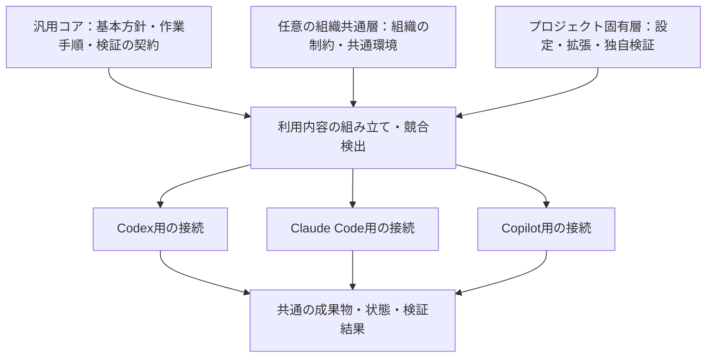

# AIエージェント共通ハーネスの設計方針

作成日・資料確認日: 2026年8月30日  
文書の状態: 実装前の設計案・レビュー用  
対象: Codex、Claude Code、GitHub Copilotを利用する開発プロジェクト

本書は、これまでの相談を一つにまとめた設計文書である。ハーネスの実装、インストール、外部レビューはまだ実施していない。本文中の構成、項目名、運用手順は設計案であり、動作確認済みの実装仕様ではない。

設計の中心は、**小さな共通コアと製品別の接続部分を用意し、各プロジェクトで拡張しながら、効果を測定して共通化・縮小・廃止できるようにすること**である。導入時の便利さだけでなく、更新、競合、撤去、モデル変更までを設計対象に含める。

本書自体を、エージェントが毎回すべて読み込む指示ファイルにすることは想定しない。実運用では、必要な部分だけを短い入口、作業別の手順、検証処理へ分ける。

## 1. 目的と対象範囲

### 1.1 目指すこと

- 一度作って終わらず、実際の失敗や手戻りから改善できる。
- 指示、スキル、フック、記録が増え続けて負債になることを防ぐ。
- Codexだけに依存せず、Claude CodeやGitHub Copilotでも同じ開発上の意図を利用できる。
- 一つのプロジェクトで得た改善を、別のプロジェクトにも再利用できる。
- 共通部分を更新しても、プロジェクト独自の設定や拡張を失わない。
- 何を導入しているか、なぜ存在するか、いつ見直すか、どう元に戻すかを説明できる。
- 人間の確認時間と手戻りを減らしつつ、品質と安全性を維持する。

### 1.2 本書で扱うもの

ハーネスを、エージェントに渡す長いプロンプトだけではなく、次の要素の組み合わせとして扱う。

| 要素 | 役割 |
| --- | --- |
| 基本指示 | プロジェクトの入口、作業上の制約、完了の定義を伝える |
| 作業別手順・スキル | 計画、調査、実装、検証、報告、振り返りの進め方を必要時に提供する |
| 検証処理 | テスト、静的解析、構造チェックなど、機械的に確認できる条件を判定する |
| 状態・成果物 | セッションをまたいで目的、進捗、判断、検証結果を引き継ぐ |
| 製品別アダプター | 各製品の指示読込、スキル配置、フック、ツール呼び出しに接続する |
| 配布・更新の仕組み | 共通部分を版固定で導入し、差分を確認して更新・撤去する |
| 改善・廃止の仕組み | 効果を評価し、共通化、修正、無効化、削除を判断する |

### 1.3 今回の対象外

- エージェント本体や独自の推論ループを一から開発すること。
- 大規模な自律実行基盤や、複数エージェントの常時運用を最初から構築すること。
- すべての作業を同じ重い工程に従わせること。
- 特定のモデル、CLI、配布サービスへの固定。
- リポジトリホスティングサービスのアカウント、認証、共同開発の運用。
- ハーネスの実装、製品設定の変更、レビューの実行。

## 2. これまでの確認事項と、設計上の提案

「相談で確認した方向性」と「その方向性を具体化するための提案」を区別する。以下の細部まで実装方法を決定済みと扱わない。

| 区分 | 内容 |
| --- | --- |
| 確認した要件 | 継続して改善でき、負債になりにくい仕組みにする |
| 確認した要件 | Codex、Claude Code、GitHub Copilotでの利用を目指す |
| 確認した要件 | 共通の配布元から複数プロジェクトへ導入できるようにする |
| 確認した方向性 | プロジェクトで拡張・改善し、汎用的な改善は共通側へ戻す |
| 確認した方向性 | 必要に応じて組織共通の層を設ける。組織固有の内容を汎用コアへ混ぜない |
| 確認した進め方 | まず設計をまとめ、利用者が別途レビューを依頼する |
| 設計案 | 共通コア、任意の組織共通層、プロジェクト固有層を分離する |
| 設計案 | 製品別の差異を薄いアダプターへ閉じ込める |
| 設計案 | 版を固定したファイルセットをプロジェクト内に導入し、管理対象と独自拡張を分ける |
| 設計案 | 改善案を評価してから有効化し、モデル更新時には不要になった補助を外して比較する |
| 未決定 | 最初の実証プロジェクト、各製品の利用形態、配布ツール、実装言語、具体的な評価閾値 |

## 3. 参考事例から採用する考え方

公開事例には、対象作業、モデル、実行環境、運用者の好みによる違いがある。本調査は普及率の調査ではなく、公開された設計パターンの比較である。「これが唯一の一般標準である」とは扱わない。出典番号は第19章に対応する。

| 参考事例 | 確認できる特徴 | 本設計への取り込み方 |
| --- | --- | --- |
| kawasin73「楽をするための AI ハーネス」 | 報告、振り返り、計画から実行への引継ぎを組み合わせている。振り返り台帳の肥大化にも言及している。[S01] | 人間が判断しやすい報告と継続改善を取り入れ、記録の整理・廃棄も最初から考える |
| 同著者「適当に作ったスキルはない方がマシ」 | 特定のスキルを有無・利用環境で比較し、効果や消費量の違いを検証している。[S02] | スキル追加を改善と同一視せず、対象作業を絞って比較する |
| Anthropicの長時間実行ハーネス事例 | 作業の分割、状態の引継ぎ、利用者視点の検証を扱い、後続の記事では構成要素を一つずつ外して簡素化している。[S03][S04] | 長い作業では明確な引継ぎを用意し、複雑な実行制御は必要性を確かめて採用する |
| Anthropicのskill-creator改善 | モデルの能力を補うスキルと、チームの仕事の進め方を表すスキルを区別して評価している。[S05] | モデル向けの一時的な補助と、継続する運用方針を区別する |
| OpenAIのAGENTS.md・スキルの文書 | 短く実務に即した指示、作業に応じたスキル利用、設定と検証の重要性を説明している。[S06][S07][S08] | 常時読み込む指示を小さく保ち、詳細は必要な場面へ分ける |
| Agent Skills仕様 | SKILL.mdと付属資料の構造、段階的な読込を定めている。[S09] | スキルの共通表現として利用し、製品固有の実行機能とは分離する |
| Spec Kit | 仕様・計画・作業への分解と、共通機能、拡張、プロジェクト固有の調整を区別している。[S14] | 成果物のつながりと拡張の分離を参考にする。全工程を必須にはしない |
| Superpowers | 作業別のスキルを組み合わせ、製品ごとの導入方法を提供している。[S15] | 共通の手順と製品別の配布・接続を分ける考え方を参考にする |

参考記事のスキル名、ファイル名、セッション分割方法をそのまま再現することは目的にしない。各仕組みが解決する問題を取り出し、必要性を実際のプロジェクトで確かめる。既存フレームワークの全面採用も、この段階では決定しない。

## 4. 全体構成

### 4.1 内容の共有範囲と、製品への接続を分ける

内容の共有には三つの層を設ける。製品別アダプターは、その共有範囲とは別の軸として扱う。

図の「組み立て」は責務を表す。最初から専用のコンパイラーや設定言語を作ることを意味しない。初期段階では、少数のテンプレートと単純な配置処理で十分かを先に検証する。

### 4.2 各層の責務

| 層 | 含めるもの | 含めないもの |
| --- | --- | --- |
| 汎用コア | 完了条件の扱い、検証結果の報告形式、引継ぎの最小項目、共通化できた手順 | 特定プロジェクトのコマンド、内部情報、個人の認証情報 |
| 組織共通層・任意 | 組織の品質要件、利用可能な実行環境、共通の開発規約 | 汎用コアの無差別な複製、個別案件の進捗 |
| プロジェクト固有層 | 実際のビルド・テスト方法、構成、対象領域、例外、追加のスキル | 共通の配布物への追跡できない直接編集 |
| 製品別アダプター | 読込場所、呼出方法、製品固有の設定項目、利用可能なフックとの接続 | 各製品で別々に書き直した基本方針や完了条件 |

組織共通層は必要になったときに追加する。個人プロジェクトでは、汎用コアとプロジェクト固有層だけで利用できる構成にする。

### 4.3 共通コアを小さく保つ

共通コアに最初から大量の機能を入れない。候補は、短い基本指示、数個の作業手順、検証結果と引継ぎの形式、導入元を記録する情報に絞る。

「あるプロジェクトで便利だった」だけで共通化を決めない。他のプロジェクトでも同じ問題があるか、設定によって差分を吸収できるか、説明や保守の負担が増えすぎないかを確認する。

## 5. 指示・設定・強制条件の分離

### 5.1 三種類に分ける

| 種類 | 例 | 扱い |
| --- | --- | --- |
| 変更可能な既定値 | 報告の形式、作業計画の詳しさ | 明示した設定項目だけを上書きできる |
| 必須の制約 | 許可されていない外部送信の禁止、必須検証 | 下位層の通常設定で弱めない。実行環境や検証でも確認する |
| 参考情報 | 過去の失敗、事例、調査資料 | 現在の指示や権限として扱わない |

変更可能な設定の解決順序は、原則として「汎用の既定値 → 組織の既定値 → プロジェクトの明示設定」とする。ただし、これは本ハーネス内の設定設計であり、各AI製品が持つ指示の優先順位を置き換えるものではない。

ハーネスは、製品の上位指示、管理者設定、サンドボックス、利用者の許可を変更したり迂回したりしない。通常の上書きでは解決できない必須制約との衝突は、衝突として報告する。

### 5.2 衝突を黙って吸収しない

- 設定項目には、上書き可能か、追加のみ可能か、変更不可かを定める。
- 必須チェックを外す設定や、同じスキル名に異なる内容を割り当てる設定は検出する。
- 未知の設定項目や、未対応の形式を黙って無視しない。
- 有効になった設定とその由来を確認できるようにする。
- 自然言語の矛盾をすべて機械判定できるとは考えない。構造化できる項目を検証し、残る曖昧さはレビュー対象にする。

### 5.3 一つの内容に一つの編集元を持たせる

共通の手順を、Codex用、Claude Code用、Copilot用に別々に手書きし続けない。編集元を一つにし、必要な入口を参照または生成する。

生成した複製が必要な場合は、編集元、生成方法、版、管理対象を記録する。生成物と正本の両方を人が編集する運用は避ける。製品ごとの差分は、目的が説明できる最小限にとどめる。

## 6. Codex・Claude Code・Copilotへの対応

### 6.1 共通化する範囲

共通化するのは、作業の目的、入力、出力、判断基準、完了条件、検証の呼出契約である。製品が持つツール名、権限設定、セッション管理、フックのイベント名まですべて統一しようとしない。

共通のスキル本文はAgent Skillsの基本構造に合わせる。製品固有のメタデータや動的な展開構文は、共通本文へ無条件に入れず、アダプター側で扱う。[S09][S11]

### 6.2 公式資料で確認した入口

以下は2026年8月30日に確認した文書上の情報であり、このプロジェクトでの実機検証結果ではない。

| 製品 | 指示・スキルの主な入口 | 設計への影響 |
| --- | --- | --- |
| Codex | AGENTS.mdによる指示と、プロジェクト内の .agents/skills によるスキル読込がある。[S07][S08] | プロジェクトの入口を短く保ち、作業別の詳細をスキルへ分ける |
| Claude Code | CLAUDE.mdを読み込む。AGENTS.mdは直接の読込対象ではなく、CLAUDE.mdからのインポートが案内されている。プロジェクトスキルは .claude/skills を利用できる。[S10][S11] | 共通の内容へつなぐ薄い入口を設け、Claude固有の拡張は分離する |
| GitHub Copilot | リポジトリ指示に .github/copilot-instructions.md などがある。AGENTS.mdやスキルの対応は利用機能を確認する。スキル資料には .github/skills、.claude/skills、.agents/skills が示されている。[S12][S13] | CLI、IDE、クラウドなどの利用形態を分けて互換性を確認する |

同じファイル名やSKILL.mdが使えることは、同じ優先順位、呼出方法、権限制御で動くことを意味しない。Claude Codeのスキルにおける allowed-tools は、記載ツール以外を利用不能にする制限ではないと明記されている。権限は実行環境側の仕様を確認する。[S11]

### 6.3 対応の水準を分ける

| 水準 | 内容 | 未対応時の扱い |
| --- | --- | --- |
| 基本モード | 共通の指示・手順を読み、同じ成果物と検証結果を残せる | 対応を目指す各製品で必要 |
| スキルとしての利用 | 製品のスキル機能から、必要な手順を発見・実行できる | 明示的に共通手順を参照する基本モードを利用できる |
| 自動化の追加 | フック、外部ツール接続、補助エージェントなど | 任意機能。対応を確認した利用形態でのみ有効化する |
| 必須制約の強制 | 権限の制限、必須検証の実行・結果確認 | 同等の強制手段がなければ、その制約を必要とする操作は実行しない |

フックが使えない場合に、報告の整形などを手動呼出へ切り替えることはできる。一方、必須の安全条件を「エージェントに気を付けてもらう」だけに置き換えない。代替できない場合は、利用範囲を読み取りなどに限定するか、その機能を未対応として扱う。

### 6.4 配置と読込で確認すること

- プロジェクトのルートからでも、実際に作業するサブディレクトリからでも、必要な指示へ到達できるか。
- 個人用のグローバル設定がなくても、必要な作業手順を利用できるか。
- 同じスキルが複数の探索ディレクトリに置かれ、二重に見つからないか。
- 製品固有の項目が、別製品で意図せず有効になったり無視されたりしないか。
- 未対応の任意機能を外しても、基本モードで作業できるか。
- Windowsを含む対象OSで、特権やシンボリックリンクを必須とせず導入できるか。

複数製品が探索するディレクトリは重なり得るため、すべての製品用ディレクトリへ同じスキルを機械的に複製する方式は採用しない。重複のない配置が検証できるまでは、共通手順を明示的に読む基本モードを使う。具体的な同時配置方式は未決定とする。

対応表には「製品名」だけでなく、利用形態、クライアントの版、検証日、利用できる機能、既知の制限を記録する。文書上の対応と実機で確認した対応を区別する。

## 7. 標準の作業フロー

### 7.1 作業の大きさに応じて工程を選ぶ

| 作業 | 推奨する進め方 |
| --- | --- |
| 小さく、影響が限定された変更 | 要件確認 → 変更 → 必要な確認 → 報告。詳細な設計書や独立レビューを一律には求めない |
| 通常の機能追加・不具合修正 | 要件と完了条件 → 必要な計画・調査 → 実装 → 検証 → 報告 |
| 不確実性や影響が大きい変更 | 設計・調査 → 判断 → 段階的実装 → 独立した確認 → 報告 |
| 複数セッションにまたがる作業 | 上記に加え、再開できる状態と未完了項目を引き継ぐ |

工程名は役割を表す。初期段階で各工程を独立したエージェントやサービスとして実装する必要はない。

### 7.2 手順の入出力

| 手順 | 主な入力 | 主な出力・完了条件 |
| --- | --- | --- |
| 計画 | 依頼、現状、制約 | 目的、対象外、完了条件、変更範囲、必要な検証 |
| 調査・試作 | 具体的な不確実性 | 調査結果、根拠、選択肢、残る不確実性。無制限に調査しない |
| 実装 | 対象と完了条件が明確な作業 | 変更内容、実施した検証、既知の制限 |
| 検証・レビュー | 変更内容、完了条件、証拠 | 指摘、重大度、再現条件、未確認事項 |
| 報告 | 結果、判断が必要な点 | 達成内容、検証の要約、未完了事項、必要な判断 |
| 振り返り | 実際の失敗・手戻り・負担 | 改善候補、根拠、対象範囲。恒久ルールへ即時反映しない |

計画から実装へ移るための情報は、会話履歴だけに依存しない。ただし、短い作業にも必ず新しいセッションを作る、一定のターン数で強制的に再開する、といった運用は初期要件にしない。

### 7.3 人間が判断しやすい報告

報告の基本項目は、何を達成したか、何で確認したか、何が未確認か、次に判断が必要か、とする。

説明が複雑な場合には図やHTMLなどを選択肢にできるが、すべての作業でHTML報告を生成しない。通常は短いMarkdownや既存の作業報告で十分かを優先する。見栄えのために別の成果物体系を増やさない。

### 7.4 レビューとモデルの扱い

独立レビューは、影響の大きい変更や判断が難しい設計で使う選択肢とする。すべての変更で複数モデルを呼び出すことは必須にしない。

レビュー役の入力と出力を共通化し、実行製品やモデルを差し替えられるようにする。モデルの選択は実行側の設定で行い、プロンプトにモデル名を書くだけで切り替えられるとは扱わない。Claude Codeではモデルの選択とフォールバックに関する設定があるため、希望したモデルと実際に使用されたモデルを区別する。[S16]

評価・レビューの記録では、確認できる場合に実際のモデルIDを記録し、不明な場合は不明とする。指定モデルが利用できない場合や別モデルへ切り替わった場合、黙って同じ結果として扱わない。

今回はレビュー依頼用のプロンプトを別途用意するだけであり、レビューの実行は利用者が行う。

## 8. コンテキスト・状態・記録の管理

### 8.1 情報の寿命を分ける

| 情報 | 保管・読込の方針 |
| --- | --- |
| 短い基本指示 | 作業開始時の入口。常に必要な内容に限定する |
| 作業別手順 | 該当する作業のときだけ読み込む |
| 現在の作業状態 | 再開に必要な内容を短く保つ |
| 設計上の決定 | 長期的に必要な理由・制約を残し、関連作業で参照する |
| 実行ログ・検証証拠 | 必要時に参照する。すべてを基本指示へ展開しない |
| 振り返りの履歴 | 集約・整理して保管し、採用された知識だけを有効な手順へ反映する |

### 8.2 引継ぎに必要な最小項目

- 目的と完了条件。
- 現在の作業範囲と、変更済みの箇所。
- 確定した判断と、その理由。
- 実施した検証、対象となる版、結果、未実施の検証。
- 残作業、妨げになっていること、次に着手すること。
- 前提となる環境と、確認すべき成果物の所在。

引継ぎは、推論過程の全文や会話の逐語記録ではなく、再開に必要な事実・判断・証拠を残す。再開側は記録を出発点にし、現在のファイルや必要な検証結果と照合する。古い完了記録だけで完了と判断しない。

### 8.3 記録を増やしすぎない

最初は、一つの作業記録に進捗・判断・検証をまとめてもよい。作業ごとのTODO、質問、摩擦、成果、振り返りなどを、必ず別ファイルにすることは求めない。

完了した作業は現在の状態から切り離す。繰り返す問題は一件の改善候補に集約し、同じ症状を毎回新しい長文として追加しない。保存期間、件数、容量の上限は利用環境に合わせて設定する。

機密情報、認証情報、無関係な個人情報は記録へ入れない。必要なログも最小化し、共有用の手順や配布物に混入させない。

## 9. 検証と完了条件

### 9.1 機械で判定できる条件を文章だけに任せない

ビルド、型チェック、静的解析、テスト、必要ファイルの存在などは、可能な範囲で既存のコマンドや検証処理に委ねる。エージェントが「問題ありません」と説明したことと、検証が成功したことを分ける。

人間が使うチェックとエージェントが使うチェックを共通にし、ハーネス専用に同じ判定を重複実装しない。ローカル実行とCIでも、可能な限り同じ検証処理を呼び出す。CIの製品や設定方式は固定しない。UIの動作が要件である場合は、必要に応じて利用者の操作に沿った確認を加える。

### 9.2 検証処理との共通契約

具体的なコマンドはプロジェクト側で定め、共通コアは次の情報を扱う。

| 項目 | 内容 |
| --- | --- |
| 検証の識別子 | 何の条件を確認するか |
| 実行方法 | 作業ディレクトリ、必要な環境、コマンド・引数 |
| 実行上の制約 | 書込、外部通信、資格情報、時間制限の有無 |
| 結果 | 成功、失敗、未実行、環境上の理由で実行不能を区別する |
| 証拠 | 実行時点、対象となる変更・版、要約、必要なログの所在 |

必須検証の失敗や未実行を、成功に読み替えない。検証不能なら、その理由と確認できた範囲を報告する。例外扱いが認められる場合も、AIが独自に適用せず、承認された例外と未検証の範囲を残す。

### 9.3 完了条件を自己都合で弱めない

ハーネスの改善処理や実装担当が、失敗を解消するためだけに完了条件を削除したり、必須テストを無効化したりしない。完了条件、権限、必須検証を変える場合は、通常の実装修正と区別して判断する。

保護が必要な条件は、実装担当から変更できない実行設定や、独立した検証でも確認する。Markdownの指示や、実装担当が自由に編集できるスクリプトだけで、条件の改変防止まで保証できるとは考えない。

仕様変更や誤ったテストの修正を禁止するものではない。その場合は、変更前後の期待動作と理由を示し、同じ修正で条件を弱めて成功を作っていないか確認する。

作業ごとに必要な検証を選ぶ。小さく可逆的な変更に、実装をなぞるだけの新規テストを一律追加することは求めない。

## 10. 負債にしない改善の仕組み

### 10.1 改善は観測から始める

改善の起点は、実際に起きた問題とする。例として、同じ場所を何度も探す、検証方法を誤る、引継ぎ後に作業をやり直す、不要な質問が続く、スキルが関係ない場面で発動する、といった摩擦を記録する。

一度の失敗に反応して、すぐに恒久ルールを追加しない。原因が環境不足、既存指示の不備、偶発的な誤り、モデルの限界、プロジェクト固有の事情のどれに近いかを切り分ける。ただし、安全上の重大な欠陥は、繰り返しを待たず対処する。

### 10.2 対処を選ぶ順序

1. 不要な指示や競合する指示を減らす。
2. 既存の環境、ドキュメント、コマンドを直す。
3. プロジェクトの設定や既存の手順を修正する。
4. 繰り返す作業に限定したスキルを追加する。
5. 機械判定できる条件を検証処理にする。
6. 必要性が確認できた場合に、フックや追加の実行制御を導入する。

順序は目安であり、明らかに機械判定すべき条件を文章で試すことは求めない。「プロンプトを増やす」以外の解決方法を先に検討するための指針である。

### 10.3 改善候補の最小記録

| 項目 | 記録する内容 |
| --- | --- |
| 問題と証拠 | どの作業で、何が起き、どのような手戻りが発生したか |
| 対処案と範囲 | 何を変更し、どの作業・プロジェクトにだけ適用するか |
| 期待する効果 | 品質、確認時間、やり直し、消費量の何を改善するか |
| 確認方法 | 既存版や対象部品なしの場合と、何を比較するか |
| 維持・廃止の判断 | 担当、見直しの契機、効果がなければどう戻すか |

初期段階では一つの小さな台帳で管理してよい。専用の改善管理サービスは作らない。担当は個人運用なら自分一人でよく、役割分担のために人数を増やさない。

### 10.4 改善候補の状態

「観測 → 候補 → 限定的な試行 → 有効化」の流れを基本にする。試行結果によっては、保留、却下、無効化、廃止へ進む。

エージェントは、候補の整理、変更案の作成、比較結果の要約を補助できる。ただし、振り返りのたびに実行中の共通指示や権限を自動更新しない。有効化する内容を確認し、既定の変更管理に従って取り込む。利用者が既に許可している通常の作業まで、毎回新たな承認を要求する仕組みにはしない。

### 10.5 ルール・スキルの性質を区別する

| 性質 | 例 | 主な見直しの契機 |
| --- | --- | --- |
| モデルの能力を補うもの | 特定の手順を忘れやすいことへの補助 | モデル更新、部品なしでの評価成功、負担の増大 |
| チームや利用者の方針を表すもの | 報告に必要な項目、開発上の進め方 | 方針や実務の変更、二重管理の発生 |
| 環境・ツールの差を吸収するもの | 製品別の入口、コマンド呼出の補助 | 製品仕様、OS、ツール更新 |
| 必須の安全・品質条件 | 許可範囲、必須検証 | 要求元の変更と、その条件を維持できる代替手段 |

この分類は、能力補助と運用方針を区別する公開事例を踏まえ、本設計向けに整理したものである。[S05]

モデルが賢くなったことだけを理由に、安全上必要な制約を外さない。一方、モデル向けの一時的な補助は、追加時から削除候補になり得ることを明確にする。

### 10.6 維持・廃止を判断する場面

- モデルやエージェント製品を変更したとき。
- 同じ作業の時間や消費量が増えたとき。
- 誤発動、矛盾、重複、例外設定が増えたとき。
- 対象となる作業がなくなったとき。
- 別の仕組みに役割が移ったとき。
- 定期的な棚卸しのとき。

棚卸しの頻度は未決定である。毎月などの暦による確認だけでなく、モデル更新などの変更イベントで見直す。不要になったものは、利用箇所、代替手段、状態の移行を確認して撤去する。

## 11. 効果の評価

### 11.1 比較する条件

基本の比較対象は、現在の安定版、改善候補版、対象の補助部品を外した版とする。初回導入では、ハーネスの追加補助がない最小構成も比較対象にする。

「部品なし」や「ハーネスなし」の比較でも、利用者の要件、評価基準、必要な権限制限、安全条件は維持する。安全策まで取り除いて有利な結果を作らない。

### 11.2 最初に用意する代表作業

| 代表作業 | 確認したいこと |
| --- | --- |
| 小さな不具合修正 | 余計な計画や報告が増えず、元の症状を確認できるか |
| 既存構成に沿う機能追加 | 必要な情報を見つけ、完了条件に沿って変更できるか |
| 不確実性のある調査 | 調査範囲を絞り、判断に必要な根拠を提示できるか |
| セッションをまたぐ再開 | 不必要に最初からやり直さず、現在の状態を確認できるか |
| 対象スキルを使わない作業 | 無関係なスキルが発動せず、通常の作業を妨げないか |

最初は三〜五件程度の小さな評価セットを候補とし、件数や内容は実証プロジェクトで決める。この件数だけで一般的な有効性を証明できるとは扱わない。

### 11.3 測る項目

- 完了条件への適合と、見逃した不具合。
- 人間の確認・修正に必要な時間、やり取りの回数。
- 作業時間、再実行、失敗からの回復。
- 取得可能な範囲のトークン消費や実行費用。
- スキルを使うべき場面での利用と、使うべきでない場面での誤発動。
- 共通部分の保守や更新に必要な負担。

品質が同等なら負担が少ない構成を選ぶ。品質改善のために費用が増える場合は、その増加が必要な作業に限定できるかを判断する。すべてを一つの総合点へ押し込まない。

### 11.4 比較を誤らないための条件

- 入力、開始時のプロジェクト状態、モデル、クライアント、利用可能なツールをそろえる。
- 可能な範囲で独立したセッションを使い、片方の回答をもう片方へ渡さない。
- 重要な比較は複数回実施し、ばらつきと失敗例も残す。
- モデルとハーネスを同時に変えた結果だけで、改善の原因を断定しない。
- 評価基準を、候補版に都合よく事後変更しない。
- 主観的な品質では、明示した基準と人間の確認を使う。AIによる自己採点だけに依存しない。
- 消費量などを取得できない場合は「不明」と記録し、ゼロとして集計しない。

初期は、既存のテスト、簡単な記録、手動の比較から始める。評価自動化のために大規模な実行基盤を先に作らない。

### 11.5 採用判断

改善候補は、狙った問題を改善しているか、重要な別の作業を悪化させないか、維持費が妥当か、戻せるかを確認して採用する。

構成要素を減らす場合も、一度に多数を外すより、影響を区別できる単位で比較する。この方法は、公開されたハーネス簡素化の事例でも採られている。[S04]

## 12. 複数プロジェクトへの配布と更新

### 12.1 基本方針

共通の配布元で管理した内容を、**特定の版に固定してプロジェクト内へ導入する**方式を第一候補にする。通常の作業が、共通配布元の最新状態や個人端末のグローバル設定に毎回左右されないようにする。

プロジェクト内に共通部分のコピーが存在しても、版と編集元を追跡でき、独自拡張が分離されていれば、無管理の複製とは区別できる。作業状態、ログ、資格情報は配布物に含めない。

### 12.2 配布方法の候補

| 方法 | 長所 | 注意点・判断 |
| --- | --- | --- |
| 版付きのファイルセット・アーカイブ | 内容と差分を確認しやすく、特定製品に依存しにくい | 配置先、所有範囲、更新方法を別途定める。初期案の第一候補 |
| 既存のスキル配布ツール | 導入・更新の一部を任せられる | スキル以外の指示、検証、設定まで管理できるとは限らない。機能を確認して選ぶ |
| 製品固有のプラグイン | 製品に合う導入体験を提供できる | 製品ごとの包み方として検討し、共通内容の唯一の保存形式にはしない |
| プロジェクトのテンプレート | 新しいプロジェクトへの初期導入が簡単 | 導入済みプロジェクトの継続更新を、テンプレートだけでは解決しない |

Codexの公式資料は、一つのプロジェクトを越えるスキル配布にプラグインを案内している。[S08] ただし、本設計が対象とするのはスキルだけではない。既存ツールの対応範囲を確認し、不足部分のみ補う方針とする。

配布用の専用CLIやパッケージ管理機構を作ることは、まだ決定しない。

### 12.3 ファイルの所有範囲

| 区分 | 例 | 更新時の扱い |
| --- | --- | --- |
| 配布側の管理対象 | 共通スキル、共通テンプレート、生成物 | 元の版と現在の内容を照合して更新する |
| プロジェクトの所有物 | 独自設定、独自手順、既存の指示、作業状態 | 共通更新で無断に上書き・削除しない |
| 既存ファイルへの接続箇所 | 共通手順への参照、管理された短い追記 | 接続箇所だけを明示的に管理し、周囲を保持する |
| 一時的な例外 | 共通部分の暫定修正 | 変更理由と基準版を記録し、更新時に再確認する |

既存のAGENTS.mdなどを丸ごと生成物へ置き換えない。最初の導入で、既存の入口を利用できるか、限定した参照の追加が必要かを確認する。

### 12.4 導入状態として記録する情報

最低限、共通部分の版と識別情報、有効な部品、管理しているファイル、プロジェクト固有部分の場所を記録する。

更新を安全に自動化する段階では、配布物のハッシュ、前回配置した内容のハッシュ、アダプターの版、設定形式の版、互換条件も記録する。形式や項目名は未決定であり、既存ツールが提供する情報を再利用できるか先に確認する。

ハッシュは内容の一致を調べるためのものであり、配布元が信頼できること自体を保証するものではない。導入元と配布内容の信頼性確認は別に必要になる。

### 12.5 導入・更新の手順

1. 配布物と対象プロジェクトの内容を読み、互換条件と変更対象を確認する。
2. 追加・変更・削除・競合・必要な移行の一覧を、適用前に提示する。
3. 現在の管理対象が前回の導入内容と一致するか確認する。変更されていれば競合として扱う。
4. 通常の変更管理に従って、確認済みの差分を適用する。
5. 必要な指示の読込、設定の整合性、代表作業を確認する。
6. 導入状態を更新し、以前の動作する版へ戻せる情報を残す。

同じ内容を再適用しても重複する指示や接続箇所を増やさない。途中で失敗した場合に、何が適用済みか分からない状態を残さない。最初は手動確認を伴う手順でもよいが、これらを満たしてから自動化する。

### 12.6 版の固定と更新時期

プロジェクトの実行時に最新の共通版へ自動追従させない。新しい版の存在を知らせることと、その版へ更新することを分ける。

複数プロジェクトでは、一部で先に確認してから展開する。スキルの発動条件、必須工程、出力形式、権限要求が変わる場合は、文章だけの変更であっても動作への影響を確認する。

版番号の付け方、互換性の分類、更新頻度は未決定である。どの方式でも、同じ識別子から同じ配布内容を取得できることを重視する。

### 12.7 ロールバックと撤去

以前の版に戻すときも、プロジェクト固有の変更を上書きしない。設定や状態の形式が変わる場合は、データを保持できる移行方法があるか、戻せない条件があるかを明示する。

撤去時は、管理対象として登録され、現在もその管理内容と一致するものだけを削除候補にする。ユーザーが編集したファイル、独自スキル、成果物、状態は保持し、判断が必要なものを一覧化する。他の部品が使う共通資源を一緒に削除しない。

ハーネスを外した後も、プロジェクト本来のビルドやテストを利用できる構成を目指す。

## 13. プロジェクトでの拡張と共通側への還元

### 13.1 成長の基本単位はプロジェクト

共通コアは初期の土台であり、すべての改善の発生場所ではない。実際の作業があるプロジェクトで問題を見つけ、そのプロジェクトに必要な改善を試す。

| 改善の種類 | 最初に置く場所 | 共通化の判断 |
| --- | --- | --- |
| 実行コマンドや対象ディレクトリ | プロジェクト設定 | 通常はプロジェクトに残す |
| 特定領域の手順 | プロジェクトの拡張 | 別のプロジェクトでも必要になれば部品化を検討する |
| 組織の共通ルール | 任意の組織共通層 | 組織の範囲で共有する |
| 共通手順の誤り・汎用的な改善 | 共通コアへの修正候補 | 再現条件と影響範囲を確認して取り込む |
| 既存共通部品への暫定対処 | 記録した例外・パッチ | 恒久的な拡張へ移すか、共通修正後に撤去する |

### 13.2 共通化する条件

- 同じ問題が別のプロジェクトでも起こる、または汎用的な不具合である。
- 固有の情報や暗黙の環境依存を分離できる。
- 適用条件と適用しない条件を説明できる。
- 確認方法があり、他の利用者への負担が妥当である。
- 共通化後にプロジェクト側の重複を取り除ける。

複数プロジェクトでの実例は有力な根拠になるが、件数だけを機械的な昇格条件にはしない。

### 13.3 共通化後の取り込み

共通側へ反映したら、新しい版を導入するプロジェクトで、既存の拡張との重複・優先順位・不要になった暫定修正を確認する。共通側とプロジェクト側に同じ改善が残り、二重に実行されることを防ぐ。

組織共通層がある場合、各プロジェクトからその層への改善循環だけでも継続できるようにする。すべての改善が汎用コアまで戻ることを必須条件にしない。共有範囲を広げる場合は、内容と共有可能性を確認し、作業ログや固有情報を自動転送しない。

## 14. 実行権限と自動化の境界

### 14.1 指示と権限を混同しない

「読み取りだけ行う」と手順に書くことと、書込ツールが実際に使えないことは別である。権限を制限する必要がある場合は、製品のツール設定、サンドボックス、実行環境などで制約を設け、その有効性を確認する。

プロジェクトの利用者が許可した通常作業を不必要に止めない一方、配布したスキルや参考文書が、それ自体で外部送信や権限拡大を許可することはない。

### 14.2 取り込む内容を確認する

ハーネスは自然言語だけでなく、実行可能なスクリプトやフックを含む可能性がある。導入・更新では、要求する権限、通信先、書込範囲、実行内容を確認する。

参考資料やログに含まれる文章を、新しいシステム指示として実行しない。外部から取り込んだ改善候補は、レビュー対象のデータとして扱う。配布物へ秘密情報やローカルな資格情報を埋め込まない。

### 14.3 自動実行を追加するときの条件

- 実行範囲、時間、回数、費用など、適用可能な上限を定める。
- 同じ失敗が続いた場合や必要な権限がない場合に、停止して状況を報告する。
- フックは対象の作業に絞り、不要な場面で高コスト処理を実行しない。
- 再実行によって同じ変更や通知を重複させない。
- 作業ディレクトリと書込先を確認し、指定範囲外へ処理が広がらないようにする。
- 必須処理の失敗を隠さず、任意処理の失敗と区別する。
- 承認待ち、未完了、実行不能を、完了として記録しない。

継続実行の制御は、実際に長時間の作業が必要になったときに追加する。モデルの出力だけを条件に無期限で自己修正するループは初期構成に含めない。

## 15. 最初に作る範囲と導入順序

### 15.1 最小構成の候補

以下は論理的な部品の一覧であり、必ずこの数だけファイルやディレクトリを作るという意味ではない。

| 部品 | 初期に必要な内容 |
| --- | --- |
| 短い入口 | プロジェクトの読み方、必要な指示の場所、検証方法、完了条件 |
| 少数の作業手順 | 計画、検証・報告、振り返りなど、実際の摩擦がある手順だけ |
| プロジェクト設定 | 実際のコマンド、対象範囲、採用する手順 |
| 一つの作業記録の形式 | 必要な場合に目的・判断・進捗・検証・次の作業をまとめる |
| 小さな評価セット | 現状と追加後を比較する代表作業 |
| 導入記録 | 共通部分の版、管理対象、独自拡張の所在 |
| 必要な製品への入口 | 対象の利用形態で共通内容を確実に読める最小の接続 |

最初から、独自のエージェント実行基盤、専用の配布CLI、大量のフック、常時動く複数モデル、専用の記録データベース、全製品のプラグインを作らない。

### 15.2 導入順序

| 段階 | 行うこと | 次に進むための確認 |
| --- | --- | --- |
| 0. 設計の確認 | 本書をレビューし、初期の対象と未決定事項を絞る | 目的と最小範囲が一致している |
| 1. 一つのプロジェクトで実証 | 主に使う製品で、小さなコアと既存検証を接続する | 現状との比較で改善や悪化を確認できる |
| 2. 製品間の確認 | 他の対象製品・利用形態で基本モードを試す | 読込、成果物、検証、権限制約の違いが明確になっている |
| 3. 別プロジェクトへ再利用 | 共通部分と固有部分を分け、版固定で導入する | 更新しても独自拡張が保たれ、撤去できる |
| 4. 必要な自動化を追加 | 実測で有効だった手順だけをフックや配布ツールへ移す | 自動化自体の負担と失敗時の扱いが妥当である |

一つの製品で動いただけでは、複数製品対応の完了とはしない。段階2を経て、実際に確認した範囲だけを対応範囲として表示する。

## 16. 実証時の受け入れ条件

以下は将来の実証で確認する項目であり、現在すでに達成済みという意味ではない。

- 各製品の対象となる利用形態で、短い入口から必要な共通手順へ到達できる。
- 個人のグローバル設定に必須要件が隠れていない。
- 対象外の作業でスキルが不必要に発動しない。
- 対象のOSで、特権を必須にせず導入できる。
- 同じスキルや指示の重複、必須条件と設定の衝突を検出・説明できる。
- 検証に失敗した場合や未実行の場合、完了として報告されない。
- 必須の強制手段がない環境では、対象操作を制限できる。
- 長い作業では、引継ぎから再開し、現在の状態を確認できる。
- 代表作業の比較によって、品質と負担の変化を説明できる。
- 追加した補助部品を外した比較ができ、不要なら無効化・撤去できる。
- どの版と部品を導入しているか確認できる。
- 更新前に変更・削除・競合が分かり、途中失敗から回復できる。
- プロジェクト独自の設定や、利用者が編集した内容を失わない。
- 同じ導入を再実行しても、重複する内容が増えない。
- 共通化した改善の取り込み後、不要になったローカルの重複を外せる。
- ロールバックや撤去の後も、プロジェクト本来の開発・検証が可能である。

## 17. 主な失敗パターンと設計上の対処

| 失敗パターン | 起こる問題 | 設計上の対処 |
| --- | --- | --- |
| すべてを基本指示に追記する | 読込負担、矛盾、重要事項の埋没 | 短い入口、必要時の読込、履歴の分離 |
| 振り返りのたびに自動でルールを増やす | 偶発的な失敗への過剰適応 | 候補化、限定試行、効果の比較 |
| 最新版に常時追従する | 同じ作業でも動作が突然変わる | 版の固定、差分確認、段階的な更新 |
| 共通配布物を各プロジェクトで直接編集する | 更新時の衝突、由来が不明になる | 所有範囲の分離、暫定修正の記録 |
| 複数製品向けに同じ内容を別々に手書きする | 方針のずれ、修正漏れ | 編集元の一元化、薄いアダプター |
| 同じスキルを複数の探索先へ置く | 重複・競合・意図しない発動 | 配置の確認、基本モードへの限定 |
| フックがない環境で必須処理が抜ける | 未検証・無制限の実行 | 同等の強制手段、対応範囲の制限 |
| 記録をそのまま共有物へ含める | 情報の混入、不要なコンテキスト | 状態と配布物の分離、情報の最小化 |
| AIが検証条件を修正して成功を作る | 完了の証拠が信用できなくなる | 条件変更の分離、独立した確認 |
| 古いモデル向けの補助を残し続ける | 不要な工程と消費量の増大 | モデル変更時の比較、部品の廃止 |
| ハーネス自体が大きな製品になる | 利用より保守に時間を使う | 既存ツールの利用、最小構成からの実証 |

## 18. 実装前に決めること

### 18.1 最初の実証前に必要な判断

1. 最初に導入するプロジェクトと、改善したい具体的な摩擦。
2. Codex、Claude Code、Copilotをどの利用形態で使うか。最初に実証する製品はどれか。
3. 対象OS、利用できるランタイム、既存の検証コマンド。
4. 初期に共通化する二〜三個程度の手順と、明示的に対象外にする作業。
5. 代表作業、比較方法、許容できない悪化。
6. 変更可能な既定値と、維持すべき必須条件の区別。

数値は初期の規模感を示す提案であり、確定した上限ではない。

### 18.2 再利用・更新の前に必要な判断

- 版付きファイルセット、既存の配布ツール、製品別プラグインのどれを使うか。
- 管理対象の記録形式、既存ファイルへの接続方法、競合の扱い。
- 複数製品が共存する場合の、重複しないスキル配置。
- 互換性の分類、設定や状態の移行方法、ロールバックの限界。
- 更新頻度、担当、廃止の判断、ログと履歴の保持基準。
- 組織共通層が必要か。必要な場合に、どこまでをその層の責務にするか。

製品の対応機能は変わるため、アダプター実装時には公式資料を再確認する。この文書には方向性と根拠を残し、頻繁に変わるコマンド一覧や料金表を恒久仕様として抱え込まない。

## 19. 参照資料

すべて2026年8月30日に確認した。製品の一次資料と、公開された運用事例を区別している。本文の設計上の推奨は、これらを踏まえた本プロジェクト向けの提案であり、各出典が本書全体の構成を保証しているわけではない。

URLは、別の環境へ文書を渡しても出典をたどれるように記載する。

### 利用者が提示した事例と、その追補

- [S01] kawasin73「楽をするための AI ハーネス」／2026年8月22日。個人の運用事例。報告、振り返り、作業の引継ぎを参照。  
  `https://kawasin73.hatenablog.com/entry/2026/08/22/124436`
- [S02] kawasin73「適当に作ったスキルはない方がマシ」／2026年8月24日。個人の比較実験。スキルの有無や利用環境による差を参照。  
  `https://kawasin73.hatenablog.com/entry/2026/08/24/171022`

### ハーネスとスキルの設計・評価

- [S03] Anthropic, “Effective harnesses for long-running agents”／2025年11月26日。長時間作業の状態引継ぎと検証の一次事例。  
  `https://www.anthropic.com/engineering/effective-harnesses-for-long-running-agents`
- [S04] Anthropic, “Harness design for long-running application development”／2026年3月24日。生成と評価の分離、構成要素の簡素化の一次事例。  
  `https://www.anthropic.com/engineering/harness-design-long-running-apps`
- [S05] Anthropic, “Improving skill-creator: Test, measure, and refine Agent Skills”。スキルの目的の分類と評価方法に関する一次資料。  
  `https://claude.com/blog/improving-skill-creator-test-measure-and-refine-agent-skills`
- [S09] Agent Skills, “Specification”。SKILL.md、付属資料、段階的な読込に関する仕様。  
  `https://agentskills.io/specification`

### 製品ごとの公式資料

- [S06] OpenAI, “Best practices”。短い指示、反復する摩擦への対処、検証に関する資料。  
  `https://learn.chatgpt.com/guides/best-practices`
- [S07] OpenAI, “Custom instructions with AGENTS.md”。Codexの指示読込に関する資料。  
  `https://learn.chatgpt.com/docs/agent-configuration/agents-md`
- [S08] OpenAI, “Build skills”。Codexのスキル配置・読込・配布に関する資料。  
  `https://learn.chatgpt.com/docs/build-skills`
- [S10] Anthropic, “How Claude remembers your project”。CLAUDE.mdとAGENTS.mdの接続に関する資料。  
  `https://code.claude.com/docs/en/memory`
- [S11] Anthropic, “Extend Claude with skills”。Claude Codeのスキル構造、拡張項目、権限に関する資料。  
  `https://code.claude.com/docs/en/skills`
- [S12] GitHub, “Adding repository custom instructions for GitHub Copilot”。Copilotの指示ファイルに関する資料。  
  `https://docs.github.com/en/copilot/how-tos/copilot-on-github/customize-copilot/add-custom-instructions/add-repository-instructions`
- [S13] GitHub, “Adding agent skills for GitHub Copilot”。Copilotのスキルに関する資料。  
  `https://docs.github.com/en/copilot/how-tos/copilot-on-github/customize-copilot/customize-cloud-agent/add-skills`
- [S16] Anthropic, “Model configuration”。モデル指定とフォールバックに関する資料。モデルの利用可否は実行環境で別途確認する。  
  `https://code.claude.com/docs/en/model-config`

### 構成を比較した公開プロジェクト

- [S14] Spec Kit。仕様から実装への流れ、共通部分と拡張の分離を参照。本文は本書確認日時点の内容。  
  `https://github.com/github/spec-kit`
- [S15] Superpowers。作業別スキルの構成と製品別の導入方法を参照。本文は本書確認日時点の内容。  
  `https://github.com/obra/superpowers`
